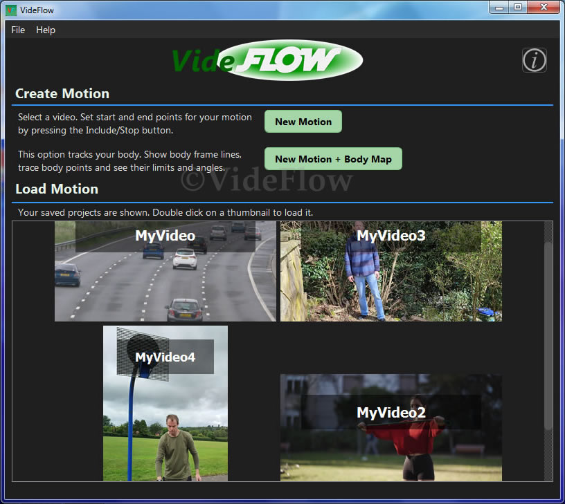
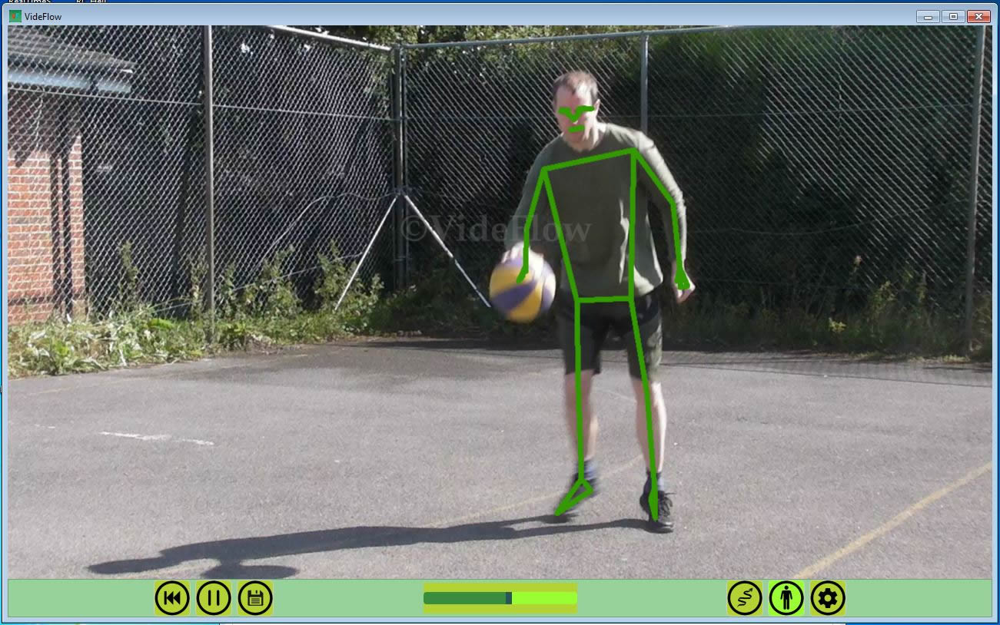
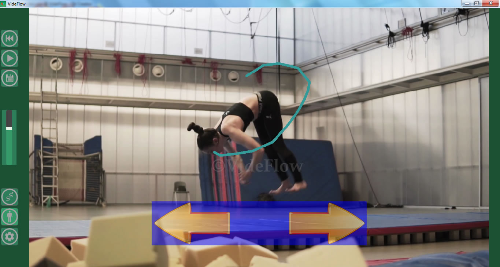

# VideFlow

**Sports Video Analysis for Windows**

VideFlow is a freeware sports video analysis application that combines slow-motion playback, frame-by-frame inspection, AI body tracking, motion visualisation, and custom object tracking. It is designed to help athletes, coaches, and sports enthusiasts study movement technique in detail.

The application runs entirely on your computer with no internet connection required, no adverts, and no personal data collection.

## Screenshots

See the screenshots folder in this repository for examples of the application in use.

## Key Features

🏃 Slow Motion Playback & Frame Analysis

- Smooth slow-motion playback
- Precise frame-by-frame control
- Pause and inspect movements in detail
- Analyse technique, posture, timing, and movement efficiency
- Ideal for sports such as tennis, golf, martial arts, gymnastics, basketball, dance, yoga, and skateboarding

🤖 AI Body Tracking & Motion Visualisation

Built-in computer vision tools help visualise human movement:

- Full-body skeletal tracking
- Body frame overlays
- Motion traces for body points
- Directional movement limits
- Joint angle measurement
- Maximum and minimum range-of-motion analysis

🎯 Custom Object Tracking

Track sports equipment and other moving objects:

- Two independent tracking points
- Motion path visualisation
- Traces and movement limits
- Suitable for balls, rackets, skateboards, and similar objects

🎬 Export & Save Analysis

- Export analysed videos as MP4 (watermarked)
- Save analysis sessions
- Return to previous work using built-in save slots
- Share exported videos with coaches and training partners

🔒 Private & Offline

- Fully offline operation
- No adverts
- No user accounts
- No personal data collection
- Runs entirely on your device

## Windows Version

VideFlow for Windows is based on the Android version released in 2023 and shares the same core analysis features and workflow. The desktop edition has been adapted for mouse and keyboard operation while maintaining a familiar user experience.

## System Requirements

Supported Operating Systems

- Windows 7 (64-bit)
- Windows 8 (64-bit)
- Windows 8.1 (64-bit)
- Windows 10 (64-bit)
- Windows 11 (64-bit)

Recommended Hardware

- CPU: 2.0 GHz or faster
- 4 GB RAM minimum
- 8 GB RAM recommended for longer clips.
- OpenGL-compatible graphics hardware optional

## Performance Notes

- Best suited to short video clips, typically 5–30 seconds
- Video processing can require significant memory resources
- High frame rate footage (60 fps or higher) improves tracking accuracy
- High-resolution videos are internally downscaled to improve performance
- AI body tracking is processed frame-by-frame for reliable results on a wide range of hardware

## Download

Download the latest release from the Releases section of this repository.

## Support

Website: https://www.sportsvideoanalysis.com

Email: videflow@sportsvideoanalysis.com

## License

VideFlow is released as freeware.

Copyright © 2026 Sun Byte Software

